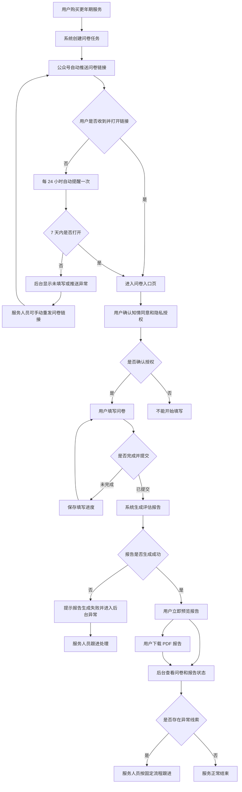

# 更年期服务问卷推送与报告需求文档

版本：v0.2  
日期：2026-05-15  
角色：医学产品经理  
范围：一期全部实现

## 1. 需求背景

用户购买更年期服务后，需要先完成一份更年期健康问卷。问卷结果用于生成个性化结论报告，帮助用户了解当前更年期相关状态，也方便后续互联网医院服务人员或医生进行服务沟通。

本次需求希望实现：用户购买服务后，系统通过咱们自己的互联网医院微信公众号自动推送问卷链接；用户填写完成后，系统自动生成报告；用户可以在线预览，也可以下载报告。

## 2. 需求目标

- 用户购买更年期服务后，可以自动收到问卷链接。
- 用户可以在微信内完成问卷填写。
- 用户提交问卷后，可以看到自己的更年期评估报告。
- 用户可以下载报告，便于保存或就诊沟通。
- 互联网医院后台可以看到用户是否已填写问卷、是否已生成报告、是否需要跟进。

## 3. 一期需求范围

一期需要完整实现以下能力：

- 购买更年期服务后自动创建问卷任务。
- 通过互联网医院微信公众号自动推送问卷链接。
- 支持用户点击链接进入问卷。
- 支持用户填写、保存进度、提交问卷。
- 支持根据问卷答案生成结论报告。
- 支持报告在线预览。
- 支持报告下载。
- 支持用户再次打开链接时查看已生成报告。
- 支持后台查看问卷状态、报告状态和推送状态。
- 支持后台手动重发问卷链接。
- 支持问卷链接 7 天有效期。
- 支持用户未填写时每 24 小时自动提醒一次。
- 支持问卷链接过期、身份不匹配、推送失败、报告生成失败等异常提示。
- 支持服务人员按固定流程跟进异常线索。

本需求不做二期、三期拆分，以上内容均纳入一期交付。

## 4. 用户流程

1. 用户购买更年期服务。
2. 系统自动创建一份问卷任务。
3. 用户收到互联网医院微信公众号推送的问卷消息。
4. 用户点击消息中的链接，进入问卷页面。
5. 用户阅读并确认知情同意和隐私授权。
6. 用户填写问卷。
7. 用户提交问卷。
8. 系统生成更年期评估报告，并立即展示。
9. 用户进入报告预览页。
10. 用户可以下载报告。
11. 后台可查看用户问卷和报告状态，必要时进行服务跟进。

## 5. 业务流程图

## 6. 用户端需求

### 6.1 问卷推送

用户购买服务成功后，应通过互联网医院微信公众号自动收到问卷链接。已确认公众号支持购买后主动推送，且用户购买服务时已绑定微信公众号身份。

推送内容需要包含：

- 服务已开通的提示。
- 请用户完成更年期健康问卷。
- 说明填写后会生成个人评估报告。
- 明确的按钮或链接，如“开始填写”。

推送文案应避免出现诊断结论、夸大承诺或过度营销表达。

如果用户未填写问卷，系统需要每 24 小时自动提醒一次，直到用户提交问卷或问卷链接过期。

### 6.2 问卷入口

用户点击链接后进入问卷入口页。

问卷链接有效期为 7 天。链接过期后，用户不能继续填写，需要由服务人员重新发送链接。

入口页需要展示：

- 本问卷用于更年期健康评估和后续服务沟通。
- 预计填写时间。
- 问卷结果不等同于医生诊断。
- 如有明显不适，应咨询医生或前往医疗机构。
- 知情同意和隐私授权确认。

用户未确认必要授权时，不能开始填写问卷。

### 6.3 问卷填写

问卷填写页需要满足：

- 适配微信内打开和手机端阅读。
- 支持分步骤填写。
- 支持必填题校验。
- 支持返回上一步修改。
- 支持中途退出后继续填写。
- 支持提交前检查是否有未填写内容。

问卷内容沿用当前更年期测评问卷逻辑，包括月经情况、症状、既往病史、生活方式等相关问题。

### 6.4 问卷提交

用户完成所有必填问题后，可以提交问卷。

提交后：

- 不允许用户直接覆盖原问卷结果。
- 如用户需要重新测评，应由后台重新发起。
- 报告生成成功后应立即进入报告页，不需要医生审核后再展示。
- 如果短时间内尚未生成完成，页面可先提示“报告生成中”。

### 6.5 报告预览

报告生成后，用户可以在线预览。

报告需包含：

- 报告标题。
- 用户姓名或昵称。
- 报告生成时间。
- 报告编号。
- 更年期阶段判断。
- 症状负担说明。
- 主要身体变化线索。
- 建议与下一步行动。
- 必要的风险提示。
- 医学免责声明。

报告表达要求：

- 不写成疾病诊断。
- 不直接给出处方、药物剂量或治疗承诺。
- 检查建议和就医建议应表达为“可与医生沟通”“建议由医生结合情况判断”。
- 语言应温和、清楚、用户能读懂，避免恐吓。

### 6.6 报告下载

用户在报告页可以下载报告。

下载要求：

- 下载格式为 PDF。
- PDF 内容应与预览报告一致。
- PDF 需包含报告编号、生成时间和免责声明。
- 用户手机号等敏感信息需要脱敏展示。
- 本期暂不要求添加互联网医院标识、水印或电子签章。
- 下载失败时，需要有明确提示，并允许用户稍后重试。

### 6.7 再次访问

用户再次打开原问卷链接时：

- 如果还未提交，进入未完成问卷，继续填写。
- 如果已经提交且报告已生成，进入报告预览页。
- 如果链接已过期但问卷未提交，提示链接已过期，并引导联系服务人员或等待重新发送。

## 7. 后台需求

后台需要支持服务人员查看和处理问卷任务。

本期报告不需要同步给医生工作台。

### 7.1 后台列表

后台列表建议展示：

- 用户姓名或昵称。
- 脱敏手机号。
- 服务名称。
- 购买时间。
- 问卷推送状态。
- 问卷填写状态。
- 报告生成状态。
- 最近更新时间。
- 是否需要人工跟进。

### 7.2 后台详情

后台详情页需要支持：

- 查看用户基本服务信息。
- 查看问卷是否已推送、已打开、填写中、已提交。
- 查看报告是否已生成。
- 查看报告预览。
- 下载报告。
- 手动重发问卷链接。
- 记录服务人员跟进备注。

### 7.3 异常处理

后台需要能看到以下异常：

- 公众号消息推送失败。
- 用户无法触达。
- 用户长时间未填写。
- 链接已过期。
- 用户身份不匹配。
- 报告生成失败。
- 报告下载失败。

异常情况需要给服务人员明确提示，便于人工处理或重新发送链接。

如报告中出现需要关注的异常线索，后台需要提示服务人员，并支持按固定跟进流程处理。

### 7.4 异常线索跟进

服务人员看到异常线索后，需要有固定跟进流程。

流程建议：

1. 后台提示存在异常线索。
2. 服务人员查看用户问卷和报告。
3. 服务人员联系用户，了解当前情况。
4. 如需要，引导用户咨询医生或前往医疗机构。
5. 服务人员在后台记录跟进结果。

## 8. 重要状态

问卷状态建议包括：

- 未推送。
- 已推送。
- 已打开。
- 填写中。
- 已提交。
- 已过期。
- 已取消。
- 待跟进。
- 已跟进。

报告状态建议包括：

- 未生成。
- 生成中。
- 已生成。
- 生成失败。
- 可下载。
- 下载失败。

提醒状态建议包括：

- 未提醒。
- 已提醒。
- 提醒失败。

## 9. 医学与合规要求

- 问卷和报告文案上线前需经过医学审核。
- 报告只能作为健康评估和服务沟通参考，不能替代医生诊断。
- 报告中涉及异常出血、严重不适、甲状腺、代谢、骨密度等内容时，应提示用户咨询医生。
- 不得在报告中自动给出处方、药品剂量或确定性治疗方案。
- 隐私授权、个人信息保存和报告查看权限需经过合规确认。
- 后台查看、下载、重发报告等操作需要保留记录。

## 10. 消息和页面文案建议

### 10.1 公众号推送文案

标题：更年期健康测评问卷

正文：您已成功开通更年期服务。请先完成一份健康问卷，提交后将生成您的专属测评报告，便于后续服务沟通。

按钮：开始填写

### 10.2 链接过期提示

问卷链接已过期。如您仍需完成测评，请联系服务人员重新发送链接。

### 10.3 报告生成中提示

您的问卷已提交，报告正在生成中，请稍候查看。

### 10.4 报告生成失败提示

报告暂时生成失败，请稍后重试。如仍无法查看，请联系服务人员处理。

### 10.5 未填写提醒文案

您还有一份更年期健康测评问卷未完成。完成后将生成您的专属测评报告，便于后续服务沟通。

按钮：继续填写

### 10.6 医学免责声明

本报告基于您填写的问卷信息生成，仅用于健康评估和服务沟通参考，不构成疾病诊断或治疗建议。如您有明显不适、异常出血或其他健康疑虑，请及时咨询医生或前往医疗机构。

## 11. 验收标准

一期上线时，需要满足以下标准：

- 用户购买更年期服务后，可以自动收到公众号问卷链接。
- 用户点击链接后，可以进入问卷并完成授权确认。
- 用户可以完整填写并提交问卷。
- 用户中途退出后，再次进入可以继续填写。
- 用户提交问卷后，可以生成报告。
- 用户提交问卷后，报告生成成功即可立即在线预览。
- 用户可以下载 PDF 报告。
- 用户再次打开链接时，可以继续填写或查看已生成报告。
- 问卷链接有效期为 7 天，过期后有明确提示。
- 用户未填写问卷时，系统可以每 24 小时自动提醒一次。
- 后台可以查看问卷推送、填写、提交和报告生成状态。
- 后台可以手动重发问卷链接。
- 后台可以提示异常线索，并支持服务人员按固定流程跟进。
- 推送失败、链接过期、身份不匹配、报告生成失败等情况有明确提示。
- 报告包含医学免责声明。
- 报告不出现确定诊断、处方、药物剂量或治疗承诺。
- 用户敏感信息在报告和后台列表中做脱敏展示。

## 12. 已确认事项

- 公众号支持在用户购买后主动推送问卷链接。
- 用户购买服务时已绑定微信公众号身份。
- 问卷链接有效期为 7 天。
- 用户提交问卷后，报告立即展示，不需要医生审核后展示。
- 报告不需要同步给医生工作台。
- PDF 报告本期暂不需要加互联网医院标识、水印或电子签章。
- 用户未填写问卷时，需要每 24 小时提醒一次。
- 服务人员看到异常线索后，需要按固定流程跟进。
