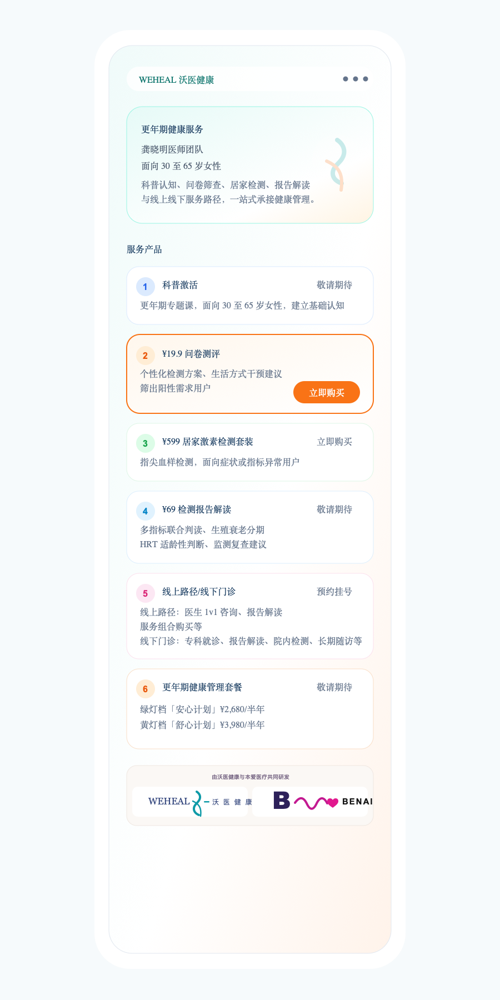
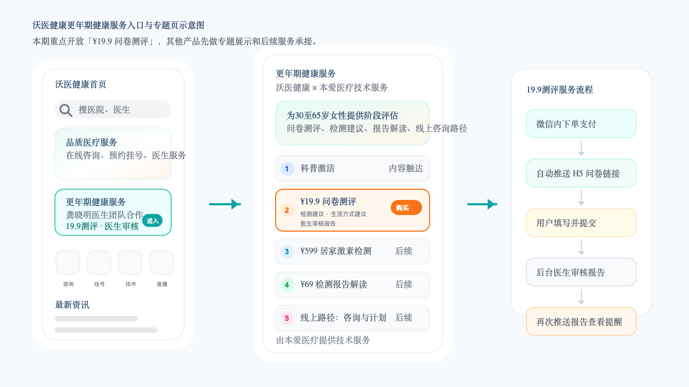
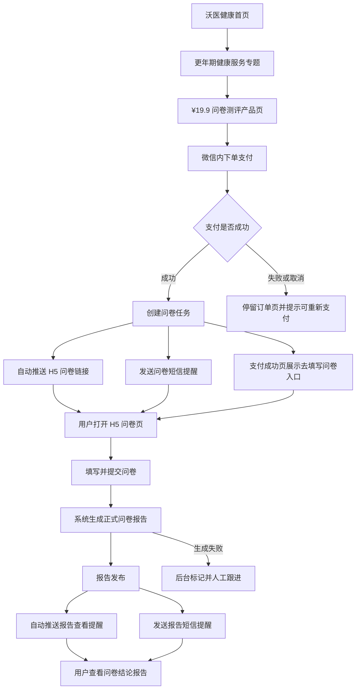

# 沃医健康更年期健康服务功能需求文档

版本：v1.0  
日期：2026-05-18  
角色：本爱医疗产品经理  
合作方：沃医集团龚晓明医生团队  
本期范围：沃医健康首页专题入口、更年期健康服务专题页、¥19.9 问卷测评购买及问卷报告闭环

## 1. 需求背景

本爱医疗与沃医集团的龚晓明医生团队开展更年期服务产品合作。合作服务需要以【沃医健康】服务号为入口，在现有首页新增“更年期健康服务”专题，承接更年期相关产品展示、用户购买、问卷填写、报告生成和报告查看。

本期先上线第 2 个产品“¥19.9 问卷测评”。用户在微信内完成下单支付后，系统自动向用户推送问卷 H5 链接，并同步发送短信提醒。用户填写并提交问卷后，系统直接生成正式问卷报告，无需医生审核；报告生成成功后，再次通过服务号/小程序消息和短信提醒用户查看报告。

本期需要从“更年期健康服务”专题开始，到问卷、报告、支付成功页、消息提醒等关键触点，合理展示“由本爱医疗提供技术服务”。问卷和结论报告需要展示“沃医集团/沃医健康”Logo，具体使用用户提供的沃医集团 Logo 资产。

## 2. 产品目标

- 在沃医健康首页形成清晰的更年期服务入口，提升目标用户发现效率。
- 通过专题页统一展示更年期服务产品矩阵，先开放“¥19.9 问卷测评”购买。
- 用户支付成功后自动收到问卷 H5 链接和短信提醒，能在微信内完成问卷填写。
- 用户提交问卷后，系统直接生成正式问卷报告，并推送给用户查看，无需医生审核。
- 报告内容承接当前智能体的问卷和结论报告能力，输出用户能读懂、医生可参考的更年期评估结果。
- 全链路体现沃医健康品牌主体和本爱医疗技术服务角色，避免用户对服务提供方产生误解。

## 3. 本期范围

### 3.1 本期做

- 沃医健康首页新增“更年期健康服务”专题入口。
- 更年期健康服务专题页展示 6 个产品服务。
- “¥19.9 问卷测评”产品详情页、购买入口和微信支付流程。
- 支付成功后创建问卷任务，并自动推送问卷 H5 链接，同时发送短信提醒。
- 用户在 H5 问卷页完成填写、校验、提交。
- 提交后系统直接生成正式问卷报告，无需医生审核。
- 报告生成成功后自动推送报告查看提醒，同时发送短信提醒。
- 用户点击提醒查看结论报告，并可在线查看或下载 PDF。
- 问卷页和报告页展示沃医集团 Logo，并展示“由本爱医疗提供技术服务”。

### 3.2 本期暂不做

- 第 1、3、4、5、6 个产品的完整购买、履约和售后流程。
- 居家检测套装物流、采样、实验室对接。
- 医生 1v1 咨询排班、问诊、处方和长期随访计划履约。
- HRT 处方推荐或药品剂量推荐。
- 与线下门诊系统、检验系统、电子病历系统的深度打通。

## 4. 服务入口与专题页

### 4.1 首页专题入口

在【沃医健康】服务号首页新增“更年期健康服务”专题入口。建议位置放在首页 Banner 下方、常用服务宫格上方，或放在“最新资讯”之前，保证用户首屏或近首屏可见。

入口卡片建议展示：

- 主标题：更年期健康服务
- 副标题：龚晓明医生团队合作，更懂 30 至 65 岁女性的身体变化
- 标签：19.9 问卷测评、提交即出报告、短信提醒
- 按钮：进入专题
- 角标：由本爱医疗提供技术服务

入口点击后进入“更年期健康服务”专题页。

### 4.2 专题页产品展示

专题页用于展示更年期服务产品矩阵。本期需要展示 6 个产品，其中仅“¥19.9 问卷测评”开放购买。

| 序号 | 产品服务 | 专题页展示内容 | 本期状态 |
| --- | --- | --- | --- |
| 1 | 科普激活 | 更年期专题课，面向 30 至 65 岁女性，建立基础认知 | 展示，暂不开放购买 |
| 2 | ¥19.9 问卷测评 | 个性化检测方案、生活方式干预建议、筛出阳性需求用户 | 本期开放购买 |
| 3 | ¥599 居家激素检测套装 | 指尖血样检测，面向症状或指标异常用户 | 展示，暂不开放购买 |
| 4 | ¥69 检测报告解读 | 多指标联合判读、生殖衰老分期、HRT 适龄性判断、监测复查建议 | 展示，暂不开放购买 |
| 5 | 线上路径/线下门诊 | 线上路径：医生 1v1 咨询、报告解读、服务组合购买等；线下门诊：线下专科就诊、报告解读、院内检测、长期随访等 | 展示，暂不开放购买 |
| 6 | 更年期健康管理套餐 | 绿灯档「安心计划」¥2,680/半年；黄灯档「舒心计划」¥3,980/半年 | 展示，暂不开放购买 |

专题页建议采用“顶部价值说明 + 本期主推产品 + 服务路径矩阵”的结构：

- 顶部展示“更年期健康服务”，说明面向 30 至 65 岁女性，覆盖科普、测评、检测、报告解读和线上咨询路径。
- 首屏突出“¥19.9 问卷测评”，标注“本期开放购买”，按钮为“立即购买”。
- 其他 5 个产品以服务卡形式展示，状态标注为“暂未开放”或“即将上线”，避免用户误以为可立即购买。
- 6 个产品按服务路径排序，从认知建立、问卷筛查、居家检测、报告解读、线上路径/线下门诊到健康管理套餐。
- 专题页展示内容字体较常规正文小一号，减少信息拥挤。
- 页面仅在底部展示“由沃医健康与本爱医疗共同研发。”。

非本期开放产品点击后建议提示“服务即将上线，可先完成问卷测评了解自身情况”，并引导用户回到“¥19.9 问卷测评”。

### 4.3 专题页重新设计稿

### 4.4 入口与专题页示意图

## 5. 总体服务流程

总体流程需符合以下链路：

进入微信小程序产品页 → 微信内下单支付 → 支付成功 → 自动推送问卷提醒 + 短信提醒 → 打开 H5 问卷页 → 提交问卷 → 系统直接生成问卷结论报告 → 自动推送报告查看提醒 + 短信提醒 → 用户查看问卷结论报告

## 6. 用户端功能需求

### 6.1 产品详情页

“¥19.9 问卷测评”产品详情页需包含：

- 产品名称：更年期健康问卷测评
- 价格：¥19.9
- 服务说明：完成问卷后，系统将直接生成专属评估报告，并通过沃医健康服务号/小程序消息和短信提醒用户查看。
- 适用人群：重点面向 30 至 65 岁，有月经变化、潮热盗汗、睡眠情绪变化、体重代谢变化等困扰的女性。
- 服务包含：问卷测评、阶段评估、症状负担说明、检测建议、生活方式建议、风险提示、报告查看提醒。
- 不包含：线下检查费用、药品费用、医生 1v1 咨询费用、长期随访服务。
- 合规提示：测评结果不等同于医学诊断，不能替代医生面诊。
- 技术服务说明：由本爱医疗提供技术服务。

页面主按钮为“立即购买”。用户已购买且问卷未提交时，按钮改为“继续填写问卷”。用户已提交且报告生成中时，按钮改为“查看报告生成进度”。用户已生成报告时，按钮改为“查看报告”。

### 6.2 下单与支付

用户在微信内点击“立即购买”后进入订单确认页并完成微信支付。

支付成功后系统需执行：

- 生成服务订单。
- 生成唯一问卷任务。
- 绑定用户微信 openid、订单号、问卷任务号。
- 生成带访问令牌的 H5 问卷链接。
- 触发服务号/小程序消息推送和短信提醒。
- 支付成功页同步展示“去填写问卷”按钮，作为推送失败时的兜底入口。

同一订单只允许生成一份有效问卷任务。用户退款或订单关闭后，未提交的问卷链接应失效；已提交或已出报告的订单需按售后规则处理。

### 6.3 问卷链接推送

支付成功后，沃医健康服务号需自动向用户推送问卷 H5 链接，并同步发送短信提醒。

推送内容建议：

- 标题：更年期健康问卷待填写
- 正文：您已成功购买“更年期健康问卷测评”。请点击下方链接完成问卷，提交后将生成您的专属评估报告。
- 按钮：开始填写

短信提醒内容建议：

- 【沃医健康】您购买的更年期健康问卷测评已开通，请点击链接完成问卷填写：{短链}。如非本人操作请忽略。

推送或短信任一通道失败时，订单详情页仍需保留问卷入口，后台需记录失败原因，并支持人工重发服务号/小程序消息或短信。

### 6.4 H5 问卷入口页

用户打开 H5 链接后进入问卷入口页。该页面内容与表达方式直接参考当前智能体“开始测评”首页，并结合沃医产品化链路补充支付、授权和报告生成说明。

入口页首屏需展示：

- 沃医集团 Logo。
- 标准依据说明：基于 STRAW+10 国际分期标准，并展示临床文献支持信息。
- 问卷名称：更年期健康问卷测评。
- 核心标题：最近的不舒服，是激素在变化吗？
- 引导文案：失眠、焦虑、月经紊乱、潮热、身体干涩等变化，可能不是单纯“老了”，而是激素正在经历重要转变。
- 核心价值说明：5 分钟测评，帮助用户看清当前阶段、症状负担，以及下一步该查什么、怎么调。
- 主按钮：开始测一测。

入口页下方需展示 3 类用户关切卡片，内容参考当前智能体首页：

- “我现在到底处在哪个阶段？”：说明测评会根据月经情况和症状，推断用户更接近 STRAW+10 的哪个阶段，并整理潮热、情绪、泌尿生殖、躯体和代谢线索，形成症状负担分级。
- “我需要去做检查吗？查什么？”：说明报告会按国内医院常见检查组套给出建议，例如性激素六项、AMH、甲状腺功能五项/七项、代谢相关检查或骨密度检查，便于用户与医生沟通。
- “除了吃药，我自己还能做什么？”：说明报告会把需要关注的风险和下一步行动放在一起，区分哪些需要检查，哪些可先从饮食、运动、睡眠或私密护理做起。

入口页还需展示：

- 填写时长：预计 5 分钟左右。
- 报告说明：提交后系统将直接生成问卷结论报告，并通过服务号/小程序消息和短信提醒用户查看。
- PDF 报告说明：测评完成并生成报告后，可查看或保存报告，便于后续就诊沟通。
- 隐私与授权：用户需确认隐私政策、个人信息处理授权和健康测评知情说明。
- 技术服务说明：由本爱医疗提供技术服务。

用户未确认必要授权时，不能开始填写。

### 6.5 问卷填写页

问卷样式及功能交互参照当前智能体问卷部分。

当前智能体能力应保留：

- 18 道核心题，按 3 个主题分页填写。
- 主题包括基础信息、月经变化、典型症状表现。
- 支持文本题、数字题、单选题、多选题和量表题。
- 支持必填校验、上一步、下一步、进度展示。
- 支持基于答案的条件展示，例如绝经状态不同会影响月经详情题展示。
- 支持异常线索实时提示，例如异常出血、月经过多等需提示用户及时咨询医生。
- 支持中途退出后继续填写。

产品化时需调整：

- 问卷顶部增加沃医集团 Logo。
- 问卷底部固定展示“由本爱医疗提供技术服务”。
- 提交按钮文案为“提交并生成报告”。
- 用户提交后进入“报告生成中/报告已生成”状态页。
- 问卷答案需提交至服务端，不能只保存在用户本地。
- 报告生成成功后，系统自动触发服务号/小程序消息推送和短信提醒。

### 6.6 问卷提交后页面

提交成功后展示报告生成结果页或报告生成中页面。

页面内容建议：

- 标题：问卷已提交，报告正在生成
- 正文：我们已收到您的问卷，系统将根据您的填写内容生成更年期健康测评报告。报告生成后将通过沃医健康服务号/小程序消息和短信提醒您查看。
- 状态：报告生成中 / 报告已生成
- 操作：返回沃医健康、查看订单、联系客服
- 说明：如出现明显不适、异常出血或其他紧急情况，请及时就医。
- 技术服务说明：由本爱医疗提供技术服务。

提交后用户不可自行修改答案。如用户确认填写有误，可由后台重新发起测评任务或人工联系用户处理。

### 6.7 报告查看提醒

问卷提交并生成报告后，系统需通过沃医健康服务号/小程序消息向用户推送报告查看提醒，并同步发送短信提醒。

推送内容建议：

- 标题：您的更年期健康测评报告已生成
- 正文：您的问卷测评报告已生成，可以点击查看本次测评结论。报告仅作为健康评估和服务沟通参考，不替代医学诊断。
- 按钮：查看报告

短信提醒内容建议：

- 【沃医健康】您的更年期健康测评报告已生成，请点击链接查看：{短链}。报告仅供健康评估参考，如有不适请及时就医。

推送或短信任一通道失败时，订单详情页和专题页个人服务入口仍需展示“查看报告”入口，后台需支持人工重发服务号/小程序消息或短信。

### 6.8 报告页

问卷结论报告形式及功能交互参照当前智能体报告部分。

当前智能体报告能力应保留：

- 报告头部：用户姓名或昵称、年龄、报告日期、报告编号。
- STRAW+10 生殖衰老分期相关说明。
- 症状负担分级与各维度说明。
- 主要身体变化线索解释。
- 建议与下一步行动，包括检查建议、生活方式建议和就医沟通建议。
- 风险提示和医学免责声明。
- 科学依据说明。
- PDF 导出。

产品化时需调整：

- 报告顶部和 PDF 页眉展示沃医集团 Logo。
- 报告页底部和 PDF 页脚展示“由本爱医疗提供技术服务”。
- 用户端报告不提供“返回修改答案”入口。
- 报告内容不得出现确定诊断、处方、药物剂量或疗效承诺。
- 报告建议应使用“建议与医生沟通”“可作为就诊参考”等表述。

## 7. 后台服务记录与异常处理需求

本期问卷提交后无需医生审核，后台重点用于查看订单、问卷、报告生成与提醒触达状态，并处理异常情况。

### 7.1 后台列表

后台需提供“更年期问卷测评”服务列表。

列表字段建议：

- 用户昵称或姓名
- 脱敏手机号
- 订单号
- 问卷任务号
- 购买时间
- 问卷提交时间
- 当前状态
- 异常线索标记
- 报告生成状态
- 服务号/小程序推送状态
- 短信发送状态
- 最近更新时间

### 7.2 后台详情

后台详情页可查看：

- 用户基础信息。
- 问卷完整答案。
- 系统识别的异常线索。
- 系统生成的报告内容。
- 报告关键结论，包括阶段判断、症状负担、风险提示和建议。
- 服务号/小程序推送记录、短信发送记录和用户打开记录。

后台可执行：

- 查看或下载报告 PDF。
- 手动重发问卷链接提醒。
- 手动重发报告查看提醒。
- 手动重发短信提醒。
- 标记需人工联系。
- 记录客服或运营处理备注。

### 7.3 处理规则

- 用户提交问卷后，系统直接生成报告并对用户可见，无需医生审核。
- 报告生成成功后，系统自动触发服务号/小程序报告查看提醒和短信提醒。
- 服务号/小程序推送或短信发送失败时，后台需记录失败原因，并支持人工重发。
- 如用户反馈填写有误，可由后台重新发起测评任务或人工联系用户处理。
- 后台操作需记录操作者、操作时间、操作前后状态和备注。

## 8. 状态设计

### 8.1 订单状态

- 待支付
- 已支付
- 已取消
- 已退款
- 售后处理中

### 8.2 问卷状态

- 待创建
- 已创建
- 问卷链接已生成
- 服务号/小程序提醒已推送
- 短信提醒已发送
- 提醒发送失败
- 已打开
- 填写中
- 已提交
- 报告生成中
- 报告已生成
- 已失效

### 8.3 报告状态

- 未生成
- 生成中
- 已生成
- 生成失败
- 服务号/小程序推送成功
- 服务号/小程序推送失败
- 短信发送成功
- 短信发送失败
- 已查看

### 8.4 用户再次进入规则

- 已支付但未打开问卷：进入问卷入口页。
- 已打开但未提交：进入上次填写进度。
- 已提交但报告生成中：进入报告生成中页面。
- 报告已生成：进入报告页。
- 服务号/小程序推送或短信提醒失败：用户仍可从订单详情页进入问卷或报告页，后台支持人工重发提醒。
- 订单已退款或问卷已失效：提示服务不可用，并引导联系客服。

## 9. 品牌与合规要求

### 9.1 品牌展示

- 专题入口和专题页需体现沃医健康服务承接主体。
- 问卷入口页、问卷填写页、报告页、PDF 报告需展示沃医集团 Logo。
- 专题页仅在底部展示“由沃医健康与本爱医疗共同研发。”；支付成功页、问卷页、报告生成页、报告页和 PDF 可在合适位置展示“由本爱医疗提供技术服务”。
- 本爱医疗技术服务说明建议使用小字号、页脚或服务说明区，不与沃医健康主品牌争夺主视觉。

### 9.2 医学合规

- 问卷题目、报告模板和医学文案上线前需由龚晓明医生团队或沃医指定医学审核人确认；这属于内容上线审核，不对单个用户报告做逐份医生审核。
- 报告仅作为健康评估和服务沟通参考，不构成疾病诊断或治疗建议。
- 不得自动给出处方、药物剂量、HRT 治疗承诺或确定性疗效描述。
- 出现异常出血、严重潮热、明显情绪风险、甲状腺或代谢异常线索时，应提示用户及时咨询医生。
- 用户隐私授权、健康数据采集、报告查看权限和后台操作日志需经合规确认。

## 10. 数据与埋点

### 10.1 关键数据

需记录以下业务数据：

- 用户身份：openid、unionid、昵称、手机号，按合规要求保存。
- 订单数据：订单号、产品 ID、支付金额、支付状态、支付时间。
- 问卷任务：任务号、链接令牌、有效期、推送状态、短信状态、填写状态、提交时间。
- 问卷答案：题目 ID、答案、版本号、提交时间。
- 报告数据：报告号、报告版本、生成状态、发布时间、查看时间。
- 提醒数据：消息类型、短信类型、发送时间、发送结果、失败原因、用户点击时间。
- 后台操作数据：操作者、操作时间、操作动作、操作前后状态和备注。

### 10.2 埋点事件

建议埋点：

- 首页专题曝光
- 首页专题点击
- 专题页曝光
- 产品卡点击
- 19.9 产品页曝光
- 点击购买
- 支付成功
- 问卷链接推送成功或失败
- 问卷短信提醒发送成功或失败
- H5 问卷打开
- 问卷开始填写
- 每页完成
- 问卷提交
- 报告生成成功或失败
- 报告提醒推送成功或失败
- 报告短信提醒发送成功或失败
- 报告打开
- PDF 下载

## 11. 异常处理

| 场景 | 用户提示 | 后台处理 |
| --- | --- | --- |
| 支付失败 | 支付未完成，请重新支付 | 不创建问卷任务 |
| 支付成功但推送失败 | 支付成功，可在订单页继续填写问卷 | 记录失败原因，支持人工重发 |
| 支付成功但短信失败 | 支付成功，可在订单页继续填写问卷 | 记录失败原因，支持人工重发短信 |
| 问卷链接身份不匹配 | 当前微信身份与订单不匹配 | 记录异常，提示联系客服 |
| 用户未提交问卷 | 可在订单页继续填写 | 可配置 24 小时后提醒 |
| 问卷提交失败 | 提交失败，请稍后重试 | 记录接口错误并告警 |
| 报告生成失败 | 报告生成中，请稍后查看 | 后台进入生成失败队列 |
| 报告推送失败 | 用户可在订单页查看报告 | 后台支持人工重发 |
| 报告短信失败 | 用户可在订单页查看报告 | 后台支持人工重发短信 |

## 12. 验收标准

- 沃医健康首页能看到“更年期健康服务”专题入口。
- 点击专题入口后能进入专题页，并看到 5 个更年期产品服务。
- 仅“¥19.9 问卷测评”可完成购买，其余产品不误导用户购买。
- 用户能在微信内完成下单和支付。
- 支付成功后自动生成问卷任务，并推送 H5 问卷链接，同时发送短信提醒。
- 支付成功页有“去填写问卷”兜底入口。
- 用户能在 H5 内完成授权、填写、校验和提交。
- 问卷样式和交互与当前智能体问卷部分保持一致。
- 用户提交后系统直接生成问卷报告，无需医生审核。
- 报告生成成功后系统自动推送报告查看提醒，同时发送短信提醒。
- 用户点击提醒后能查看问卷结论报告。
- 后台能查看问卷答案、报告内容、推送状态和短信状态。
- 报告样式和交互与当前智能体报告部分保持一致。
- 问卷页和报告页展示沃医集团 Logo。
- 专题页底部展示“由沃医健康与本爱医疗共同研发。”，支付成功页到报告页的关键触点展示“由本爱医疗提供技术服务”。
- 报告中包含医学免责声明，不出现诊断、处方、药物剂量或疗效承诺。
- 推送失败、短信失败、身份不匹配、报告生成失败等异常有明确提示和后台处理路径。

## 13. 待确认事项

- 沃医健康首页专题入口最终位置和视觉规格。
- 沃医集团 Logo 的正式源文件、使用规范和安全边距。
- “由本爱医疗提供技术服务”的准确法务文案。
- 支付成功后可用的微信消息模板类型和跳转能力。
- 支付成功后和报告生成后的短信服务商、短信签名、短信模板和短链规则。
- 问卷链接默认有效期，建议 7 天，可由运营后台配置。
- 报告生成 SLA 和失败重试规则。
- PDF 报告是否需要固定声明、水印或报告编号规则。
- 退款后已提交问卷和已发布报告的查看权限规则。
